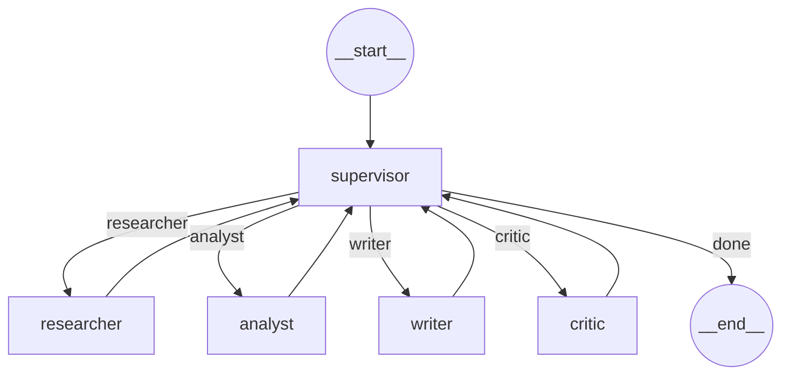
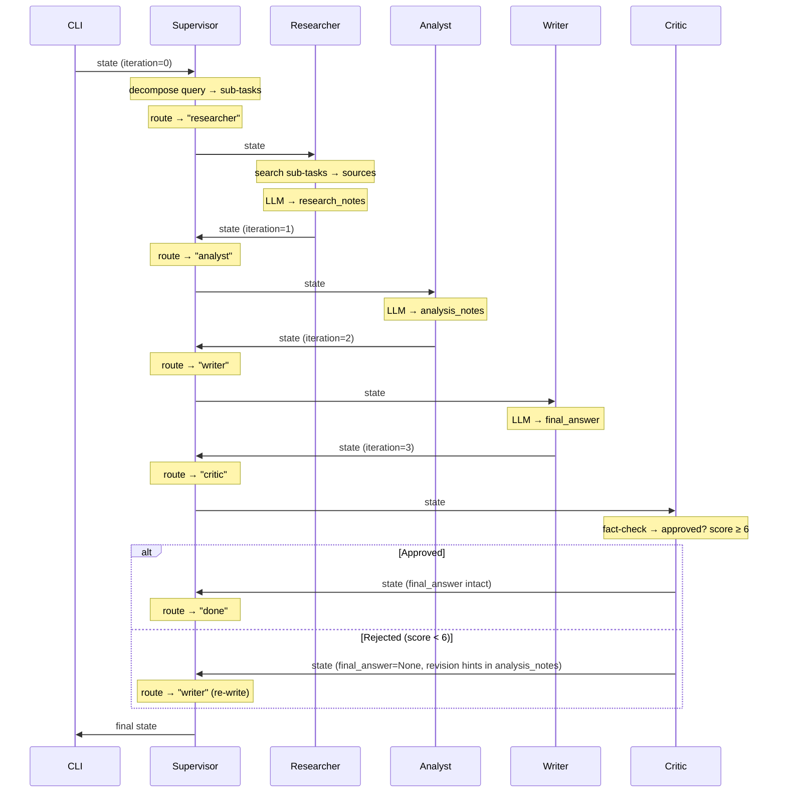

# Multi-Agent Workflow Graph Design

## Graph Topology



## Execution Flow (Happy Path)



## Node Definitions

| Node | Agent Class | Input from State | Output to State |
|---|---|---|---|
| `supervisor` | `SupervisorAgent` | Toàn bộ state | `route_history`, `trace` (sub-tasks) |
| `researcher` | `ResearcherAgent` | `request.query`, `trace` (sub-tasks) | `sources`, `research_notes` |
| `analyst` | `AnalystAgent` | `research_notes`, `sources` | `analysis_notes` |
| `writer` | `WriterAgent` | `research_notes`, `analysis_notes`, `sources` | `final_answer` |
| `critic` | `CriticAgent` | `final_answer`, `sources` | score, hoặc clear `final_answer` |

## Routing Logic (Conditional Edges)

Sau node `supervisor`, LangGraph đọc `state.route_history[-1]` để quyết định edge:

```python
def routing_function(state: dict) -> str:
    """Read the last route from supervisor and return the next node name."""
    route_history = state.get("route_history", [])
    if not route_history:
        return "supervisor"  # safety fallback
    last_route = route_history[-1]
    if last_route == "done":
        return END
    return last_route
```

## Stop Conditions

| Condition | Trigger | Result |
|---|---|---|
| `route == "done"` | Supervisor emits "done" | Graph reaches `__end__` |
| `iteration >= max_iterations` | Runaway loop guard | Supervisor forces "done" |
| `final_answer is not None` after Critic approves | Normal completion | Supervisor routes "done" |

## Error Handling

| Scenario | Strategy |
|---|---|
| Agent raises exception | Catch in node wrapper → ghi vào `state.errors` → trả state về supervisor |
| LLM timeout / API error | `tenacity` retry 3 lần trong `LLMClient` → nếu vẫn fail → log error |
| Critic rejects (score < 6) | Clear `final_answer` → re-route qua Writer (max 1 revision) |
| Max iterations exceeded | Supervisor forces "done" → trả state hiện tại |

## Implementation Approach

### `build()` method:
```python
from langgraph.graph import StateGraph, END

graph = StateGraph(state_schema=ResearchState)

# 1. Add nodes
graph.add_node("supervisor", supervisor_node)
graph.add_node("researcher", researcher_node)
graph.add_node("analyst", analyst_node)
graph.add_node("writer", writer_node)
graph.add_node("critic", critic_node)

# 2. Set entry point
graph.set_entry_point("supervisor")

# 3. All workers → back to supervisor
graph.add_edge("researcher", "supervisor")
graph.add_edge("analyst", "supervisor")
graph.add_edge("writer", "supervisor")
graph.add_edge("critic", "supervisor")

# 4. Supervisor → conditional routing
graph.add_conditional_edges("supervisor", routing_function, {
    "researcher": "researcher",
    "analyst": "analyst",
    "writer": "writer",
    "critic": "critic",
    END: END,
})

return graph.compile()
```

### `run()` method:
```python
def run(self, state: ResearchState) -> ResearchState:
    app = self.build()
    result = app.invoke(state.model_dump())
    return ResearchState(**result)
```

## Key Design Decisions

> [!IMPORTANT]
> **Hub-and-spoke topology**: Mọi worker đều quay lại Supervisor sau khi chạy xong.
> Supervisor là node DUY NHẤT có conditional edges. Các worker chỉ có fixed edge về supervisor.

> [!NOTE]
> **Critic là optional**: Nếu muốn bỏ critic để tiết kiệm token, chỉ cần xóa node và edge liên quan — không ảnh hưởng đến các agent khác.

> [!WARNING]
> **LangGraph state schema**: `StateGraph` cần dùng dict-based state, không phải Pydantic object trực tiếp. Cần convert `ResearchState ↔ dict` ở ranh giới in/out.
